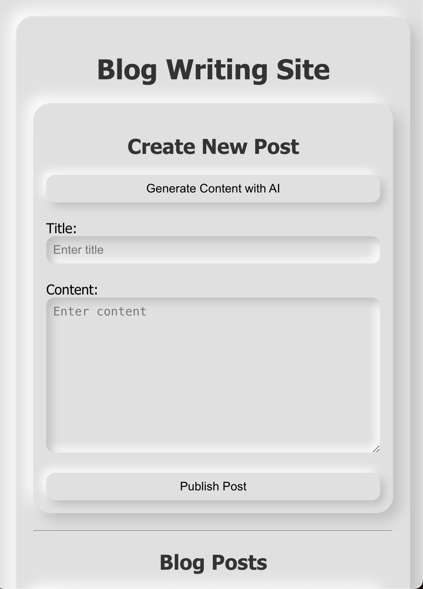

# React MongoDB Generative AI Blog App

A full-stack blog application built using React, Node.js, Express, MongoDB, and OpenAI's GPT models to generate blog content. The project features a Neumorphism-inspired design, making it visually appealing and user-friendly.

## Features

- Generate blog content using OpenAI's GPT models.
- Create, view, and delete blog posts.
- Neumorphism design for a modern and soft 3D look.
- Fully responsive layout.

## Tech Stack

- **Frontend**: React, CSS (Neumorphism design).
- **Backend**: Node.js, Express, MongoDB.
- **Generative AI**: OpenAI GPT models for content creation.

## Getting Started

To get started with this project, follow these steps:

### Prerequisites

- Node.js and npm installed
- MongoDB instance running
- OpenAI API key

### Clone the Repository

```bash
git clone https://github.com/oguzbasaran/react-mongodb-genai-blog-app.git
cd react-mongodb-genai-blog-app
```

### Backend Setup

Navigate to the backend folder:

```bash
cd blog-backend
```

Install dependencies:

```bash
npm install
```

Create a `.env` file in the `blog-backend` directory and add your MongoDB URI and OpenAI API key:

```env
MONGODB_URI=your_mongodb_connection_string
OPENAI_API_KEY=your_openai_api_key
```

Start the backend server:

```bash
npm start
```

The backend will run on [http://localhost:5000](http://localhost:5000).

### Frontend Setup

Open a new terminal and navigate to the frontend folder:

```bash
cd blog-frontend
```

Install dependencies:

```bash
npm install
```

Start the frontend development server:

```bash
npm start
```

The frontend will run on [http://localhost:3000](http://localhost:3000).

## Usage

1. Open [http://localhost:3000](http://localhost:3000) in your browser.
2. Use the "Generate AI Content" button to generate blog posts with the help of OpenAI's GPT models.
3. Create and delete blog posts as needed.

## API Endpoints

### Backend Routes

- `GET /api/posts`: Fetch all blog posts.
- `POST /api/posts`: Create a new blog post.
- `DELETE /api/posts/:id`: Delete a blog post by ID.
- `POST /api/generate/generate-ai-content`: Generate AI-powered blog content.

## Neumorphism Design

This project uses Neumorphism design principles to create a soft, 3D effect on UI elements, giving the application a modern and aesthetic look. The design is fully responsive and adapts to various screen sizes.

## License

## License

This project is licensed under the MIT License. See the [LICENSE](./LICENSE) file for details.

## Contributing

Contributions are welcome! Please fork this repository and submit a pull request with your changes.

## Contact

Created by [oguzbasaran](https://github.com/oguzbasaran) – feel free to reach out!
